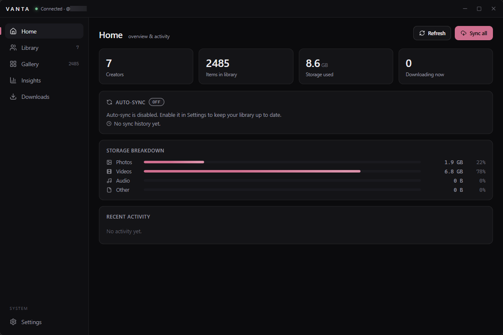
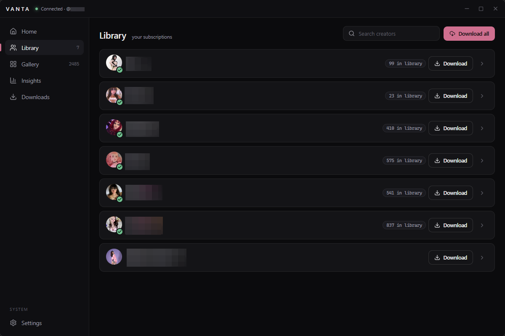
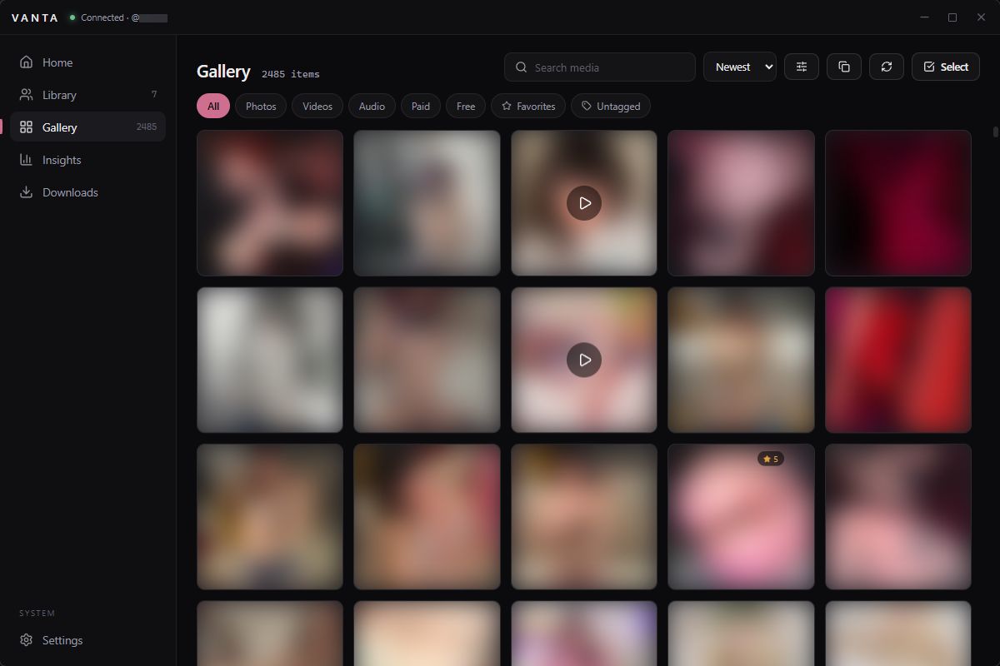
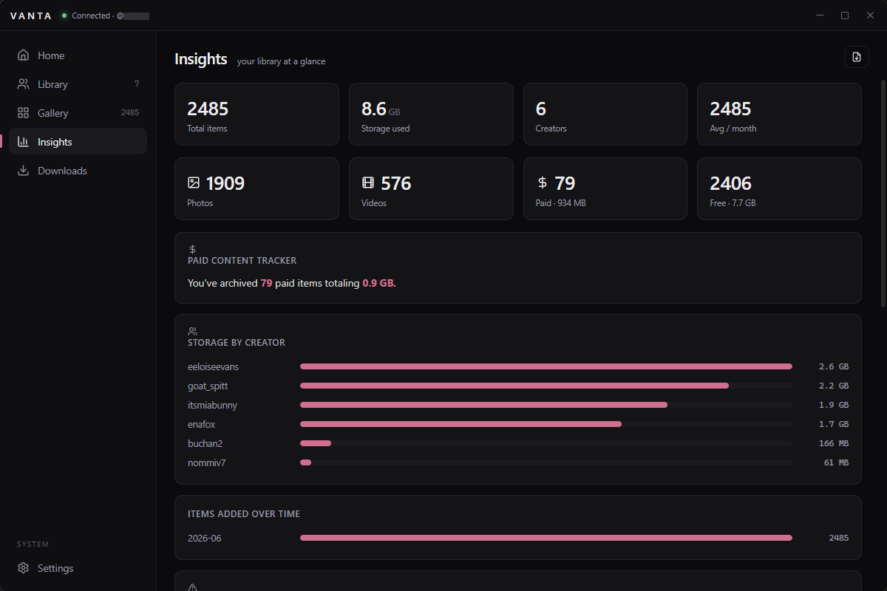

<div align="center">

# VANTA

**A premium, privacy-first desktop client for browsing and archiving OnlyFans content.**

Built with Tauri 2 · Rust core · React 19 · TypeScript


[Features](#features) · [Screenshots](#screenshots) · [Architecture](#architecture) · [Getting Started](#getting-started) · [Privacy](#privacy)

</div>

---

> ⚠️ **Disclaimer:** This project is for educational and personal archival purposes only. It is not affiliated with, endorsed by, or sponsored by OnlyFans. Users are responsible for complying with the terms of service of any platform they interact with. All content downloaded using this tool is stored locally and remains the property of its respective creators.

---

## Screenshots

| Home | Library |
|:---:|:---:|
|  |  |

| Gallery | Insights |
|:---:|:---:|
|  |  |

## Features

### Download & Sync

| Feature | Description |
|---|---|
| Full archive downloads | Posts, archived posts, stories, highlights, and DMs from any creator |
| Batch "Sync All" | Download everything from all your subscriptions in one click |
| Background auto-sync | Periodically checks for and downloads new content automatically |
| Incremental sync | Tracks last-seen post IDs per creator to avoid re-fetching old content |
| Download options | Skip stories/messages, photos-only, videos-only, paid-only, free-only, date-range filtering |
| Bandwidth limiting | Cap download speed to avoid saturating your connection |
| Per-job pause/resume | Pause individual downloads without killing them |
| Retry with backoff | Failed downloads automatically retry with exponential backoff |
| Download logging | Every download is logged to SQLite for auditability |

### Gallery & Library

| Feature | Description |
|---|---|
| Virtualized grid | Handles millions of items smoothly with IntersectionObserver lazy-loading |
| Smart filters | By type (photo/video/audio), paid/free, favorites, untagged, date range, rating |
| Collections | Organize media into named collections |
| Tags | Tag any item, filter by tags with clickable chips |
| 1-5 star ratings | Rate items, sort and filter by rating |
| Duplicate finder | SHA-1 hash-based exact duplicate detection with one-click cleanup |
| Right-click context menu | Open, reveal, favorite, rate, tag, copy path, delete |
| Grid density | Small / Medium / Large tile sizes |
| Group by creator | Organize the grid by creator |

### Media Viewing

| Feature | Description |
|---|---|
| Image lightbox | Zoom/pan, rotation, keyboard navigation, filmstrip |
| Custom video player | Scrub bar, volume, playback speed (0.5x-2x), frame capture |
| Audio player | Custom UI with seek bar and volume for audio content |
| Slideshow mode | Auto-advance through items |

### Privacy & Security

| Feature | Description |
|---|---|
| PIN lock | PBKDF2-SHA256 hashed PIN (100k iterations), backward-compatible with legacy SHA-1 |
| Duress PIN | Secondary PIN that unlocks to an empty library |
| Panic hotkey | Global hotkey to instantly hide and lock the app |
| Auto-lock | Lock on window blur or after configurable inactivity timeout |
| Stealth mode | Disguise window title in taskbar (e.g. "Files") |
| Blur thumbnails | Blur gallery thumbnails until hover |
| Credential blur | Credentials are blurred by default in Settings |
| Clear on panic | Optionally clear clipboard and activity log on panic |

### Insights & Analytics

| Feature | Description |
|---|---|
| Storage breakdown | Photos, videos, audio, and other by size |
| Per-creator stats | Storage used and item count per creator |
| Download history | Timeline of recent downloads with status |
| Paid content tracker | Total archived paid content value |
| Content coverage | Posts saved vs. total posts per creator |
| CSV export | Export library metadata to CSV |

### Platform

| Feature | Description |
|---|---|
| System tray | Minimize to tray, right-click menu, left-click toggle |
| Window state persistence | Remembers position, size, and maximized state |
| Close-to-tray | Keep running in background when closed |
| Command palette | Ctrl+K to quick-switch views and run commands |

## Architecture

```
┌──────────────────────────────────────────────────────────────┐
│ Web UI (Vite + React 19 + TypeScript)                        │
│  • Screens: Home, Library, Gallery, Downloads, Insights,     │
│    Settings                                                  │
│  • Zustand state management                                  │
│  • Framer Motion animations                                  │
│  • CSS custom properties for theming                         │
│  • Virtualized grid (@tanstack/react-virtual)                │
└───────────▲───────────────────────────────────┬──────────────┘
            │ invoke(command)                    │ listen(event)
┌───────────┴───────────────────────────────────▼──────────────┐
│ Tauri 2 Rust core                                            │
│  • api.rs       — OF API client with request signing         │
│  • commands.rs  — Tauri command handlers                     │
│  • downloads.rs — Concurrent download engine                 │
│  • library.rs   — SQLite media index (favorites/tags/ratings)│
│  • config.rs    — JSON config persistence                    │
│  • downloader.rs— Download list builder                      │
└────────────────────────────────────────────────────────────────┘
```

## Keyboard Shortcuts

| Shortcut | Action |
|:---:|---|
| `Ctrl + K` | Open command palette |
| `?` | Show keyboard shortcuts |
| `←` `→` | Navigate media in lightbox |
| `Space` | Play / pause video |
| `F` | Toggle favorite (in lightbox) |
| `R` | Reveal file in Explorer (in lightbox) |
| `S` | Toggle slideshow (in lightbox) |
| `Esc` | Close lightbox / menu |
| `Ctrl + Shift + H` | Panic — hide & lock VANTA |

## Getting Started
### Prerequisites

- [Node.js](https://nodejs.org/) 22+
- [Rust](https://rustup.rs/) (stable)
- Windows 10/11 (WebView2 runtime is pre-installed on Win10/11)
- [Chrome](https://www.google.com/chrome/) (for the Credential Helper extension)

### Getting Your Credentials

VANTA needs your OnlyFans authentication data to connect. Use the included Chrome extension:

1. Load the `datagrabber/` folder as an unpacked extension in Chrome (`chrome://extensions` > Developer mode > Load unpacked)
2. Log into OnlyFans and browse a few pages
3. Click the VANTA Credential Helper extension icon
4. Click "Copy for VANTA"
5. Paste the values into VANTA Settings > Credentials

See [`datagrabber/README.md`](datagrabber/README.md) for details.

### Development

```bash
# Install dependencies
npm install

# Run in development mode
npm run tauri dev
```

### Production Build

```bash
# Build Windows installer + standalone .exe
npm run tauri build
```

Output is generated in `src-tauri/target/release/`.

### Project Structure

```
VANTA/
├── datagrabber/                # Chrome extension (credential helper)
│   ├── manifest.json           #   Extension manifest (MV3)
│   ├── background.js           #   Service worker — captures x-bc
│   ├── popup.html              #   Extension popup UI
│   ├── popup.css               #   Dark theme styles
│   └── popup.js                #   Popup logic
├── src/                        # Frontend (React + TypeScript)
│   ├── components/             #   Reusable UI components
│   ├── screens/                #   Top-level views (Home, Gallery, etc.)
│   ├── lib/                    #   API bindings & utilities
│   ├── store.ts                #   Zustand state management
│   └── styles.css              #   Full design system
├── src-tauri/                  # Backend (Rust)
│   ├── src/
│   │   ├── api.rs              #   OF API client + request signing
│   │   ├── commands.rs         #   Tauri command handlers
│   │   ├── downloads.rs        #   Concurrent download engine
│   │   ├── library.rs          #   SQLite media index
│   │   ├── config.rs           #   Config persistence
│   │   ├── downloader.rs       #   Download list builder
│   │   └── lib.rs              #   Tauri setup + tray + auto-sync
│   ├── Cargo.toml              #   Rust dependencies
│   └── tauri.conf.json         #   Tauri configuration
├── screenshots/                # App screenshots
├── package.json                # Frontend dependencies
└── vite.config.ts              # Vite configuration
```

## Themes

VANTA ships with three built-in themes, plus accent color customization:

| Theme | Description |
|---|---|
| **Graphite** (default) | Cool monochrome dark |
| **Bone** | Warm light/paper |
| **Clay** | Warm dark/earthy |

All themes persist across restarts and can be combined with any accent color.

## Privacy

VANTA is designed with privacy as a first-class concern:

- ✅ All data is stored locally — nothing is sent to any server except the OnlyFans API
- ✅ Credentials are stored in a local config file, never transmitted except to OnlyFans
- ✅ The SQLite library database contains only file paths, favorites, tags, ratings, and sync metadata — no media content
- ✅ Downloaded files are stored in their original format on your local filesystem
- ✅ No telemetry, analytics, or tracking of any kind

## Tech Stack

| Layer | Technology |
|---|---|
| Frontend | React 19, TypeScript, Vite 7 |
| State Management | Zustand |
| Animations | Framer Motion |
| Icons | Lucide React |
| Virtualization | @tanstack/react-virtual |
| Backend | Rust (Tauri 2) |
| HTTP Client | reqwest (native TLS) |
| Database | SQLite (rusqlite, WAL mode) |
| Image Processing | image crate |
| Desktop Integration | Tauri 2 (tray, shortcuts, notifications, window state) |

## Contributing

Contributions are welcome! Please feel free to submit a pull request or open an issue.

1. Fork the repository
2. Create your feature branch (`git checkout -b feature/amazing-feature`)
3. Commit your changes (`git commit -m 'Add amazing feature'`)
4. Push to the branch (`git push origin feature/amazing-feature`)
5. Open a pull request

### Guidelines

- Follow the existing code style (Rust: `cargo fmt`, TypeScript: `tsc --noEmit`)
- Test your changes: `npm run build` (frontend) + `cargo build` (backend) should both pass with zero warnings
- Keep the UI minimal — VANTA's design philosophy is "grounded minimalism": no glassmorphism, no neon, every pixel earns its place
- Respect the privacy-first architecture — no external telemetry or tracking

## License

Apache-2.0 — see [LICENSE](LICENSE).